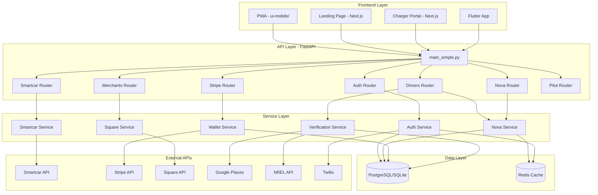

# NERAVA CURRENT STATE (for ChatGPT deep audit)

**Generated:** 2025-01-XX  
**Repo Commit:** `02df5b31726316233acdfdc72feb3a3f563210c6`  
**Auditor:** Codebase Recon + Production Readiness Auditor

---

## 0. Repo Snapshot

### Repo Name
**Nerava** - EV charging rewards platform

### High-Level Tree (Top 2 Levels)
```
Nerava/
├── nerava-backend-v9/          # FastAPI backend (Python 3.10+)
│   ├── app/                     # Main application code
│   │   ├── routers/            # 92 route handlers
│   │   ├── services/           # 102 service modules
│   │   ├── models/             # SQLAlchemy models
│   │   ├── middleware/         # 7 middleware modules
│   │   ├── security/           # 7 security modules
│   │   ├── alembic/            # 31 migration files
│   │   └── tests/              # 19 test files
│   ├── alembic/                # Database migrations
│   └── requirements.txt        # Python dependencies
├── ui-mobile/                   # Progressive Web App (vanilla JS)
│   ├── js/                     # Frontend JavaScript
│   ├── css/                    # Stylesheets
│   └── index.html              # Entry point
├── landing-page/                # Next.js landing page
├── charger-portal/              # Next.js charger portal
├── mobile/nerava_flutter/       # Flutter mobile app
├── charts/                      # Kubernetes Helm charts
├── tests/                       # Integration tests
├── e2e/                         # End-to-end tests
└── scripts/                     # Utility scripts
```

### Tech Stack

**Backend:**
- FastAPI 0.103.2 (Python web framework)
- SQLAlchemy 2.0.23 (ORM)
- Alembic 1.12.1 (migrations)
- Pydantic 2.5.0 (validation)
- python-jose 3.3.0 (JWT)
- Stripe >=6.0.0 (payments)
- httpx >=0.24.0 (HTTP client)
- Redis >=5.0.0 (caching)
- psycopg2-binary >=2.9.0 (PostgreSQL)

**Frontend:**
- Vanilla JavaScript (no framework)
- Leaflet (maps)
- Service Worker (PWA)

**Database:**
- SQLite (development)
- PostgreSQL (production)

**Integrations:**
- Smartcar (EV telemetry)
- Square (merchant payments)
- Stripe (payouts)
- Google Places API (merchant discovery)
- NREL API (charger data)
- Twilio (SMS/OTP)

### What Actually Runs in Prod

**Primary Entry Point:** `nerava-backend-v9/app/main_simple.py`
- FastAPI app with 90+ routers
- Serves static UI from `ui-mobile/` at `/app/`
- Auto-runs migrations on startup
- Uses Gunicorn + Uvicorn workers in production

**Deployment:** Railway/Render/Fly.io (auto-detects `Procfile`)
- Command: `gunicorn app.main_simple:app --workers 4 --worker-class uvicorn.workers.UvicornWorker`

---

## 1. How to Run Locally

### Backend Start Command

```bash
cd nerava-backend-v9
python -m uvicorn app.main_simple:app --port 8001 --reload
```

**Production (Gunicorn):**
```bash
gunicorn app.main_simple:app --workers 4 --worker-class uvicorn.workers.UvicornWorker --bind 0.0.0.0:8000
```

### Frontend Start Command

Frontend is served by backend at `/app/` (no separate server needed).

**Standalone (if needed):**
```bash
cd ui-mobile
python3 -m http.server 8080
```

### Env Vars Required

**Critical (see `ENV.example`):**
- `DATABASE_URL` - SQLite/PostgreSQL connection string (default: `sqlite:///./nerava.db`)
- `JWT_SECRET` - JWT signing secret (default: `dev-secret`)
- `PUBLIC_BASE_URL` - Base URL for redirects (default: `http://127.0.0.1:8001`)
- `ALLOWED_ORIGINS` - CORS origins (default: `*`)

**Third-Party APIs:**
- `SMARTCAR_CLIENT_ID`, `SMARTCAR_CLIENT_SECRET`, `SMARTCAR_REDIRECT_URI`
- `STRIPE_SECRET`, `STRIPE_WEBHOOK_SECRET`
- `SQUARE_APPLICATION_ID`, `SQUARE_ACCESS_TOKEN`, `SQUARE_LOCATION_ID`
- `GOOGLE_PLACES_API_KEY`
- `NREL_API_KEY`
- `TWILIO_ACCOUNT_SID`, `TWILIO_AUTH_TOKEN` (for OTP)

**Reward Configuration:**
- `VERIFY_REWARD_CENTS` - Verification reward (default: 200¢)
- `PURCHASE_REWARD_FLAT_CENTS` - Purchase reward (default: 150¢)
- `PAYOUT_MIN_CENTS`, `PAYOUT_MAX_CENTS`, `PAYOUT_DAILY_CAP_CENTS`

**Security:**
- `TOKEN_ENCRYPTION_KEY` - Fernet key for Square token encryption (44 chars)
- `WEBHOOK_SHARED_SECRET` - Webhook authentication

**Where Referenced:**
- `app/config.py` - Centralized settings via Pydantic Settings
- `app/core/config.py` - Additional core settings
- Environment variables loaded via `python-dotenv` in `main_simple.py`

### Test Commands

```bash
# Backend tests
cd nerava-backend-v9
pytest tests/ -v

# Specific test suites
pytest tests/test_auth_google.py -v
pytest tests/test_refresh_rotation.py -v
pytest tests/integration/test_ev_connect_flow.py -v

# Frontend E2E (Playwright)
cd ui-mobile
npm run test:ui
```

### Lint/Format Commands

```bash
# Black (formatting)
black nerava-backend-v9/app/

# Ruff (linting)
ruff check nerava-backend-v9/app/

# Config in pyproject.toml
```

### DB Migration Commands

```bash
cd nerava-backend-v9

# Run migrations
alembic upgrade head

# Create new migration
alembic revision --autogenerate -m "description"

# Migrations auto-run on startup (see main_simple.py:38-44)
```

---

## 2. Architecture Map



**Key Data Flows:**

1. **Driver Sign-Up/Login** → `auth_domain.py` → `AuthService` → `users` table
2. **Smartcar Connect** → `ev_smartcar.py` → OAuth callback → `vehicle_accounts`, `vehicle_tokens` tables
3. **Nova Earn** → `nova_domain.py` → `NovaService.grant_to_driver()` → `driver_wallets`, `nova_transactions` tables
4. **Nova Redeem** → `pilot_redeem.py` → `NovaService.redeem_from_driver()` → Updates driver + merchant balances
5. **Stripe Payout** → `stripe_api.py` → `payouts.create()` → Debits wallet, creates Stripe transfer
6. **Square Onboarding** → `merchants_domain.py` → OAuth → Stores encrypted token → `domain_merchants` table

---

## 3. Critical User Flows (code-grounded)

### Driver Sign-Up/Login

**Flow:**
1. `POST /v1/auth/register` → `app/routers/auth_domain.py:82`
   - Validates email/password
   - Calls `AuthService.register_user()` → `app/services/auth_service.py`
   - Creates `User` record in `users` table
   - Returns JWT access token

2. `POST /v1/auth/login` → `app/routers/auth_domain.py:115`
   - Validates credentials
   - Calls `AuthService.authenticate_user()`
   - Returns JWT token (24h expiry, default)

3. **Magic Link (Email-only):**
   - `POST /v1/auth/magic_link/request` → `app/routers/auth_domain.py:190`
   - Generates time-limited token (15 min expiry)
   - Sends email via `get_email_sender()` → `app/core/email_sender.py`
   - `POST /v1/auth/magic_link/verify` → Validates token, creates session

**Token Refresh:**
- `POST /v1/auth/refresh` → `app/routers/auth_domain.py:310`
- Uses refresh token rotation (see `app/services/refresh_token_service.py`)
- Old refresh token invalidated on use

**Logout:**
- `POST /v1/auth/logout` → `app/routers/auth_domain.py:157`
- Revokes refresh token → `refresh_tokens` table marked `revoked=True`

**Code Locations:**
- `app/routers/auth_domain.py` - Main auth endpoints
- `app/services/auth_service.py` - Business logic
- `app/core/security.py` - JWT creation/verification
- `app/middleware/auth.py` - Token validation middleware

### Smartcar Connect + Callback

**Flow:**
1. `GET /v1/ev/connect` → `app/routers/ev_smartcar.py:114`
   - Creates signed state JWT with `user_public_id` → `app/core/security.py:create_smartcar_state_jwt()`
   - Returns Smartcar Connect URL with `state` parameter

2. User authorizes on Smartcar → Redirects to `/oauth/smartcar/callback`

3. `GET /oauth/smartcar/callback` → `app/routers/ev_smartcar.py:164`
   - Verifies state token → `verify_state_token()` → Extracts `user_public_id`
   - Exchanges code for tokens → `exchange_code_for_tokens()` → `app/services/smartcar_service.py:45`
   - Lists vehicles → `list_vehicles()` → Gets first vehicle ID
   - Upserts `VehicleAccount` → `app/models_vehicle.py:VehicleAccount`
   - Creates `VehicleToken` record (access_token, refresh_token encrypted)
   - Redirects to frontend with success

**State Token Security:**
- Uses `SMARTCAR_STATE_SECRET` (or `JWT_SECRET` fallback)
- JWT expires in 10 minutes
- Stateless (no session storage)

**Code Locations:**
- `app/routers/ev_smartcar.py` - OAuth endpoints
- `app/services/smartcar_service.py` - Smartcar API client
- `app/core/security.py` - State token creation/verification
- `app/models_vehicle.py` - Vehicle data models

### Nova Earn Pipeline

**Flow:**
1. Driver completes charging session → `POST /v1/pilot/sessions/{session_id}/verify` → `app/routers/drivers_domain.py:111`
   - Calls `verify_dwell()` → `app/services/session_service.py:178`
   - Validates GPS pings, dwell time (60s), location accuracy

2. Admin grants Nova → `POST /v1/nova/grant` → `app/routers/nova_domain.py:27`
   - Calls `NovaService.grant_to_driver()` → `app/services/nova_service.py:28`
   - Updates `driver_wallets.nova_balance` (+amount)
   - Creates `NovaTransaction` record (type="driver_earn")
   - Marks wallet activity → `mark_wallet_activity()` → Triggers wallet pass refresh

**Auto-Accrual (Demo Mode):**
- Background service → `app/services/nova_accrual.py`
- Runs every 60s, grants Nova to active sessions
- Started on app startup → `main_simple.py:675`

**Code Locations:**
- `app/routers/nova_domain.py` - Grant endpoint
- `app/services/nova_service.py` - Balance management
- `app/models/domain.py` - `DriverWallet`, `NovaTransaction` models
- `app/services/nova_accrual.py` - Demo accrual service

### Nova Redeem Pipeline

**Flow:**
1. Driver redeems discount code → `POST /v1/pilot/redeem_code` → `app/routers/pilot_redeem.py:37`
   - Validates code → `fetch_code()` → `app/services/codes.py`
   - Checks code not expired, not already redeemed
   - Debits merchant balance → `debit_balance()` → `app/services/merchant_balance.py`
   - Marks code as redeemed → `merchant_offer_codes.is_redeemed=True`
   - Creates `RewardEvent` for reporting

2. **Direct Nova Redeem (Merchant):**
   - `POST /v1/nova/redeem` → `app/routers/nova_domain.py` (if exists)
   - Calls `NovaService.redeem_from_driver()` → `app/services/nova_service.py:81`
   - Debits driver wallet, credits merchant balance
   - Creates two transactions: `driver_redeem` + `merchant_earn`

**Code Locations:**
- `app/routers/pilot_redeem.py` - Code redemption endpoint
- `app/services/nova_service.py` - Redeem logic
- `app/services/codes.py` - Code validation
- `app/models/domain.py` - `MerchantRedemption` model

### Wallet Pass Install/Updates

**Flow:**
1. **Apple Wallet:**
   - `GET /v1/wallet_pass/apple/pass` → `app/routers/wallet_pass.py:45`
   - Generates `.pkpass` file → `app/services/apple_wallet_pass.py`
   - Signs with Apple certificates (if `APPLE_WALLET_SIGNING_ENABLED=true`)
   - Returns pass file

2. **Pass Registration:**
   - `POST /v1/wallet_pass/apple/register` → `app/routers/wallet_pass.py:95`
   - Stores device registration → `apple_pass_registrations` table
   - Enables push updates

3. **Pass Updates:**
   - Triggered by `mark_wallet_activity()` → `app/services/wallet_activity.py`
   - Updates `driver_wallets.wallet_activity_updated_at`
   - Apple polls `/v1/wallet_pass/apple/passes/{passTypeIdentifier}/{serialNumber}` for updates

**Code Locations:**
- `app/routers/wallet_pass.py` - Pass endpoints
- `app/services/apple_wallet_pass.py` - Pass generation
- `app/services/wallet_activity.py` - Activity tracking
- `app/models/domain.py` - `ApplePassRegistration` model

### Square Onboarding / Merchant Linking

**Flow:**
1. Merchant initiates OAuth → `GET /v1/merchants/square/connect` → `app/routers/merchants_domain.py`
   - Generates Square OAuth URL with `state` parameter
   - Redirects to Square authorization page

2. Square callback → `GET /v1/merchants/square/callback` → `app/routers/merchants_domain.py`
   - Exchanges code for access token
   - Encrypts token → `encrypt_token()` → `app/services/token_encryption.py`
   - Stores in `domain_merchants.square_access_token` (encrypted)
   - Updates `square_merchant_id`, `square_location_id`

**Code Locations:**
- `app/routers/merchants_domain.py` - Square OAuth endpoints
- `app/services/square_service.py` - Square API client
- `app/services/token_encryption.py` - Fernet encryption
- `app/models/domain.py` - `DomainMerchant` model

### Stripe Money Movement

**Flow:**
1. Driver requests payout → `POST /v1/payouts/create` → `app/routers/stripe_api.py:31`
   - Validates amount (min 100¢, max 10,000¢, daily cap 20,000¢)
   - Checks idempotency via `client_token` → Searches `payments.metadata`
   - Debits wallet → Inserts `wallet_ledger` row (negative amount)
   - Creates `payments` record (status='pending')

2. **Stripe Transfer:**
   - If Stripe keys configured → `create_transfer()` → `app/clients/stripe_client.py`
   - Creates Stripe Express account if needed → `create_express_account_if_needed()`
   - Initiates transfer to connected account
   - Updates `payments.status='paid'` on success

3. **Webhook Confirmation:**
   - `POST /v1/stripe/webhook` → `app/routers/stripe_api.py:364`
   - Verifies signature → `stripe.Webhook.construct_event()`
   - On `transfer.paid` event → Updates `payments.status='paid'`

**Code Locations:**
- `app/routers/stripe_api.py` - Payout endpoints
- `app/clients/stripe_client.py` - Stripe API client
- `app/models.py` - `payments`, `wallet_ledger` tables

---

## 4. Data Model + Integrity

### Key DB Tables/Models

**Users & Auth:**
- `users` (`app/models/user.py`)
  - PK: `id` (INTEGER)
  - Unique: `email`, `public_id`
  - FK: None
  - Columns: `email`, `password_hash`, `display_name`, `role_flags`, `public_id`, `stripe_account_id`

- `refresh_tokens` (`app/models/user.py`)
  - PK: `id` (INTEGER)
  - FK: `user_id` → `users.id`
  - Unique: `token_hash` (indexed)
  - Columns: `user_id`, `token_hash`, `expires_at`, `revoked`, `created_at`

**Vehicles:**
- `vehicle_accounts` (`app/models_vehicle.py`)
  - PK: `id` (STRING UUID)
  - FK: `user_id` → `users.id`
  - Unique: None (multiple vehicles per user allowed)
  - Columns: `user_id`, `provider` ("smartcar"), `provider_vehicle_id`, `is_active`

- `vehicle_tokens` (`app/models_vehicle.py`)
  - PK: `id` (STRING UUID)
  - FK: `vehicle_account_id` → `vehicle_accounts.id`
  - Unique: None
  - Columns: `vehicle_account_id`, `access_token` (encrypted), `refresh_token` (encrypted), `expires_at`, `scope`

**Nova/Wallet:**
- `driver_wallets` (`app/models/domain.py`)
  - PK: `user_id` (INTEGER) → `users.id`
  - FK: `user_id` → `users.id`
  - Unique: None
  - Columns: `user_id`, `nova_balance`, `energy_reputation_score`, `wallet_pass_token`, `wallet_activity_updated_at`

- `nova_transactions` (`app/models/domain.py`)
  - PK: `id` (STRING UUID)
  - FK: `driver_user_id` → `users.id`, `merchant_id` → `domain_merchants.id` (nullable)
  - Unique: None
  - Columns: `id`, `type` ("driver_earn", "driver_redeem", "merchant_earn"), `driver_user_id`, `merchant_id`, `amount`, `session_id`, `event_id`, `transaction_meta` (JSON)

**Merchants:**
- `domain_merchants` (`app/models/domain.py`)
  - PK: `id` (STRING UUID)
  - FK: `owner_user_id` → `users.id` (nullable)
  - Unique: `qr_token` (indexed)
  - Columns: `id`, `name`, `lat`, `lng`, `zone_slug`, `nova_balance`, `square_merchant_id`, `square_access_token` (encrypted), `qr_token`, `status`

**Charging Sessions:**
- `domain_charging_sessions` (`app/models/domain.py`)
  - PK: `id` (STRING UUID)
  - FK: `driver_user_id` → `users.id`, `event_id` → `energy_events.id`, `merchant_id` → `domain_merchants.id` (nullable)
  - Unique: None
  - Columns: `id`, `driver_user_id`, `event_id`, `merchant_id`, `started_at`, `ended_at`, `verified`, `verification_source`, `kwh_consumed`

**Payments:**
- `payments` (`app/models.py`)
  - PK: `id` (INTEGER auto-increment)
  - FK: `user_id` → `users.id`
  - Unique: None
  - Columns: `user_id`, `amount_cents`, `payment_method`, `status` ("pending", "paid", "failed"), `transaction_id`, `metadata` (JSON)

- `wallet_ledger` (`app/models.py`)
  - PK: `id` (INTEGER auto-increment)
  - FK: `user_id` → `users.id`
  - Unique: None
  - Columns: `user_id`, `amount_cents`, `transaction_type` ("credit", "debit"), `reference_id`, `reference_type`, `balance_cents`, `metadata` (JSON)

### Missing Constraints (Data Integrity Risks)

1. **Duplicate Users:**
   - `users.email` has unique constraint ✅
   - `users.public_id` has unique constraint ✅
   - **Risk:** None (properly constrained)

2. **Duplicate Vehicle Links:**
   - `vehicle_accounts` allows multiple vehicles per user ✅
   - **Risk:** None (by design)

3. **Double Redemption:**
   - `merchant_offer_codes.is_redeemed` flag prevents double redemption ✅
   - **Risk:** Race condition if two requests process simultaneously (no DB-level unique constraint on code+redeemed)

4. **Wallet Balance Integrity:**
   - `wallet_ledger.balance_cents` is computed, not enforced ✅
   - **Risk:** Balance can drift if ledger entries are inserted out of order or if concurrent updates occur
   - **Fix:** Use `SELECT COALESCE(SUM(amount_cents), 0)` for balance calculation (already done in `stripe_api.py:109`)

5. **Nova Balance Integrity:**
   - `driver_wallets.nova_balance` updated in application code ✅
   - **Risk:** Concurrent grants/redemptions could cause race conditions
   - **Fix:** Use database-level `UPDATE driver_wallets SET nova_balance = nova_balance + :amount WHERE user_id = :id` (see `nova_service.py:56` - uses `+=` which is not atomic)

6. **Idempotency Gaps:**
   - Payouts: Idempotency via `client_token` in `payments.metadata` ✅
   - Nova grants: No idempotency key → **RISK: Double grants possible**
   - Code redemption: No idempotency key → **RISK: Race condition on `is_redeemed` flag**

### Idempotency Requirements (Not Implemented)

1. **Nova Grant Endpoint** (`/v1/nova/grant`)
   - **Missing:** Idempotency key parameter
   - **Risk:** Admin could accidentally grant twice
   - **Fix:** Add `idempotency_key` param, check `nova_transactions` for existing grant with same key

2. **Code Redemption** (`/v1/pilot/redeem_code`)
   - **Missing:** Transaction-level locking
   - **Risk:** Two concurrent requests could both pass `is_redeemed` check
   - **Fix:** Use `SELECT ... FOR UPDATE` or database-level unique constraint

3. **Wallet Credit** (`/v1/wallet/credit_qs`)
   - **Missing:** Idempotency check
   - **Risk:** Webhook retries could credit twice
   - **Fix:** Add idempotency key, check `wallet_ledger` for existing credit

---

## 5. Security Posture (REAL)

### Where Secrets Live

**Environment Variables (`.env` file):**
- `JWT_SECRET` - JWT signing (default: `dev-secret` ⚠️)
- `TOKEN_ENCRYPTION_KEY` - Fernet key for Square tokens (44 chars)
- `STRIPE_SECRET`, `STRIPE_WEBHOOK_SECRET`
- `SMARTCAR_CLIENT_SECRET`
- `SQUARE_APPLICATION_SECRET`
- `TWILIO_AUTH_TOKEN`
- `WEBHOOK_SHARED_SECRET`

**Hardcoded Secrets:**
- `app/security/jwt.py:90` - Uses `settings.database_url` as JWT secret (⚠️ **CRITICAL BUG**)
  ```python
  jwt_manager = JWTManager(secret_key=settings.database_url)  # WRONG!
  ```
  Should use `settings.jwt_secret` instead.

**Files:**
- `.env` (gitignored, but no secrets manager integration)
- No AWS Secrets Manager / HashiCorp Vault integration

### JWT Handling

**Signing:**
- Algorithm: `HS256` (default)
- Secret: `JWT_SECRET` env var (but bug in `jwt.py:90` uses `database_url`)
- Expiry: 24 hours (default) → `app/core/security.py:20`
- Issuer: `"nerava-api"` → `app/security/jwt.py:32`

**Storage:**
- Access token: Returned in response body (not HTTP-only cookie in most endpoints)
- Refresh token: Stored in DB as hash → `refresh_tokens.token_hash`
- Frontend: Stored in localStorage (⚠️ **XSS risk**)

**Rotation:**
- Refresh tokens rotated on use → `app/services/refresh_token_service.py:45`
- Old token invalidated → `revoked=True`

**Verification:**
- Middleware: `app/middleware/auth.py:37`
- Extracts `Bearer` token from `Authorization` header
- Calls `jwt_manager.verify_token()` → `app/security/jwt.py:45`

### Refresh Token Storage/Hashing

**Storage:**
- Table: `refresh_tokens`
- Hash: Uses `passlib.hash.pbkdf2_sha256` → `app/services/refresh_token_service.py:25`
- Columns: `token_hash`, `expires_at`, `revoked`, `created_at`

**Rotation:**
- On refresh: Old token marked `revoked=True`, new token created
- Prevents replay attacks ✅

### OTP Challenge Handling + Rate Limits

**OTP Flow:**
- `POST /v1/auth/otp/send` → `app/routers/auth_domain.py` (if exists)
- Uses Twilio → `app/core/email_sender.py` (or Twilio client)
- Rate limiting: Via `RateLimitMiddleware` → 120 req/min per IP

**Rate Limits:**
- Global: 120 req/min → `app/middleware/ratelimit.py`
- Per-user: Not implemented for OTP
- **Risk:** OTP spam possible

### Web Security

**CORS:**
- Config: `app/main_simple.py:416`
- Origins: `ALLOWED_ORIGINS` env var (default: `*` ⚠️)
- Credentials: `allow_credentials=True`
- Methods: `["*"]`
- Headers: `["*"]`
- **Risk:** Wildcard origins in production if `ALLOWED_ORIGINS=*`

**CSRF:**
- No CSRF protection
- **Risk:** State-changing endpoints vulnerable if CORS misconfigured

**XSS:**
- Frontend: Vanilla JS, no framework XSS protection
- Token storage: localStorage (XSS can steal tokens)
- **Risk:** High if frontend has XSS vulnerabilities

**Token Storage:**
- Access token: Response body (not HTTP-only cookie)
- Frontend: localStorage
- **Risk:** XSS can steal tokens

### Dependency Red Flags

**Outdated Libraries:**
- Check `requirements.txt`:
  - `fastapi==0.103.2` (current: 0.115.x) - Minor version behind
  - `sqlalchemy==2.0.23` (current: 2.0.36) - Security patches available
  - `python-jose==3.3.0` (current: 3.3.0) - ✅ Up to date
  - `stripe>=6.0.0` - ✅ Flexible version

**Insecure Patterns:**
1. JWT secret bug (uses `database_url` instead of `jwt_secret`)
2. No secrets manager (secrets in `.env` file)
3. Wildcard CORS in dev (should be restricted in prod)

### Abuse Cases

**Replay Attacks:**
- Refresh tokens: Protected (rotation + revocation) ✅
- Access tokens: Not protected (24h expiry, no revocation list)
- **Risk:** Stolen access token valid for 24h

**State Hijack:**
- Smartcar OAuth: State token signed with JWT ✅
- Expires in 10 minutes ✅
- **Risk:** None (properly implemented)

**Redemption Fraud:**
- Code redemption: `is_redeemed` flag (race condition risk)
- No rate limiting on redemption endpoint
- **Risk:** Brute force code guessing possible

**Double Spending:**
- Wallet balance: Computed from ledger ✅
- Nova balance: Application-level update (race condition risk)
- **Risk:** Concurrent grants/redemptions could cause double spending

---

## 6. Observability + Operations

### Logging

**Where:**
- `app/main_simple.py:16-22` - Basic logging config
- `app/middleware/logging.py` - Request/response logging
- Structured logging: Partial (some endpoints use `logger.info()` with `extra={}`)

**What Fields:**
- Request: Method, path, status code
- Response: Status code, timing (via `MetricsMiddleware`)
- Structured: `{"at":"reward","step":"commit","sid":"session-id","uid":1}` (see `README_DEV.md:189`)

**Structured:**
- Partial - Some services use structured logging (`app/services/rewards_engine.py` logs JSON)
- Most logs are plain strings

### Metrics

**Implementation:**
- `app/middleware/metrics.py` - `MetricsMiddleware`
- Tracks: Request count, response time, error count
- Exporter: Prometheus client → `prometheus-client>=0.19.0`
- Endpoint: Not exposed (no `/metrics` endpoint found)

**Missing:**
- Business metrics (Nova grants, redemptions, payouts)
- Database query metrics
- External API latency metrics

### Tracing

**Implementation:**
- None (no OpenTelemetry, no distributed tracing)
- **Missing:** Request tracing across services

### Error Reporting

**Implementation:**
- Logging only (no Sentry, Rollbar, etc.)
- Errors logged to stdout → `app/main_simple.py:160`
- **Missing:** Error aggregation and alerting

### Health Checks / Readiness Checks

**Endpoints:**
- `GET /health` → `app/routers/health.py`
  - Returns: `{"ok": true}`
  - No DB check, no external dependency check

- `GET /version` → `app/routers/meta.py`
  - Returns: Git SHA, build time

**Missing:**
- Readiness probe (DB connectivity check)
- Liveness probe (dependency health)

### Background Jobs / Schedulers

**Jobs:**
- Nova accrual service → `app/services/nova_accrual.py`
  - Runs every 60s
  - Started on app startup → `main_simple.py:675`
  - Demo mode only

**Missing:**
- Cron scheduler (no Celery, no APScheduler)
- No job queue (no Redis Queue, no Bull)

### Retry Strategy for Third-Party Calls

**Implementation:**
- Circuit breaker: `app/services/circuit_breaker.py` (for wallet service)
- Retry: Not implemented for external APIs
- Timeouts: `httpx` default (5s) → `app/services/async_wallet.py:56`

**Missing:**
- Retry logic for Stripe, Square, Smartcar API calls
- Exponential backoff

---

## 7. Performance + Reliability

### N+1 Queries

**Potential Issues:**
- `app/services/rewards_engine.py:27` - Queries followers per reward:
  ```python
  followers = [r.follower_id for r in db.query(Follow).filter(Follow.followee_id == user_id).all()]
  ```
  - **Risk:** N+1 if called in loop

- `app/routers/drivers_domain.py:230` - TODO comment: "Enrich with perks/logo/walk_time data"
  - **Risk:** Multiple queries per merchant

**Mitigation:**
- Some endpoints use `joinedload()` (check `app/dependencies_domain.py`)

### Chatty Endpoints

**Issues:**
- `/v1/pilot/merchants/nearby` → Calls Google Places API per request (no caching)
- `/v1/ev/me/telemetry/latest` → Polls Smartcar API on every request (no caching)

**Fix:**
- Add Redis caching for external API responses

### Expensive Calls

**External APIs:**
- Google Places API: No rate limiting on backend (relies on API key limits)
- NREL API: No caching
- Smartcar API: Polled on every telemetry request

**Database:**
- Wallet balance: `SELECT COALESCE(SUM(amount_cents), 0)` on every request (no materialized balance)
- **Fix:** Use `driver_wallets.nova_balance` (already materialized for Nova)

### Caching

**Implementation:**
- Redis: Available (`redis>=5.0.0` in requirements)
- Usage: Not implemented (no cache decorators found)
- **Missing:** Cache layer for external APIs, DB queries

### Rate Limiting / Throttling

**Implementation:**
- `app/middleware/ratelimit.py` - `RateLimitMiddleware`
- Global: 120 req/min per IP
- Per-user: Not implemented
- Per-endpoint: Not implemented

**Missing:**
- Per-user rate limits (prevent abuse by single user)
- Endpoint-specific limits (e.g., OTP: 5/min)

### DB Connection Management

**Implementation:**
- SQLAlchemy connection pool (default settings)
- No explicit pool size configuration found
- **Risk:** Connection exhaustion under load

### Timeouts for External APIs

**Implementation:**
- `httpx`: Default 5s timeout → `app/services/async_wallet.py:56`
- `requests`: No explicit timeout (uses default)
- **Risk:** Hanging requests if external API is slow

### Idempotency Keys for Critical Endpoints

**Implemented:**
- Payouts: `client_token` → `app/routers/stripe_api.py:79`
- Charge stop: Idempotency service → `app/routers/energyhub.py:93`

**Missing:**
- Nova grants: No idempotency key
- Wallet credits: No idempotency key
- Code redemption: No idempotency key

---

## 8. Deployment Readiness

### Current Deployment Approach

**Platforms:**
- Railway (auto-detects `Procfile`)
- Render (GitHub integration)
- Fly.io (Dockerfile or nixpacks)

**Procfile:**
```
web: gunicorn app.main_simple:app --workers 4 --worker-class uvicorn.workers.UvicornWorker --bind 0.0.0.0:$PORT
```

**Docker:**
- `Dockerfile.localdev` exists (for local dev)
- No production Dockerfile found

**Migrations:**
- Auto-run on startup → `app/main_simple.py:38`
- **Risk:** Migrations run on every instance (could cause conflicts)
- **Fix:** Run migrations in separate job before deployment

### Missing Infrastructure Pieces

1. **TLS:**
   - Railway/Render provide TLS automatically ✅
   - **Missing:** Certificate rotation monitoring

2. **Domains:**
   - `PUBLIC_BASE_URL` env var (must be set manually)
   - **Missing:** Domain validation, DNS health checks

3. **Secrets Manager:**
   - Secrets in `.env` file (committed to repo in `ENV.example`)
   - **Missing:** AWS Secrets Manager, HashiCorp Vault integration

4. **DB Migrations in CI:**
   - Migrations run on app startup (not in CI)
   - **Missing:** Pre-deployment migration job

5. **Database Backups:**
   - No backup script found (check `scripts/db_backup.sh` - exists but not automated)
   - **Missing:** Automated daily backups

6. **Monitoring:**
   - No APM (New Relic, Datadog)
   - No error tracking (Sentry)
   - **Missing:** Production monitoring stack

### Env Var Matrix for Dev/Stage/Prod

**Dev:**
- `DATABASE_URL=sqlite:///./nerava.db`
- `JWT_SECRET=dev-secret`
- `ALLOWED_ORIGINS=*`
- `DEMO_MODE=true`

**Stage:**
- `DATABASE_URL=postgresql://...` (PostgreSQL)
- `JWT_SECRET=<strong-secret>`
- `ALLOWED_ORIGINS=https://stage.nerava.app`
- `DEMO_MODE=false`

**Prod:**
- `DATABASE_URL=postgresql://...` (PostgreSQL with SSL)
- `JWT_SECRET=<strong-secret>` (rotated periodically)
- `ALLOWED_ORIGINS=https://app.nerava.app,https://www.nerava.app`
- `DEMO_MODE=false`
- `STRIPE_SECRET=sk_live_...`
- `SMARTCAR_MODE=live`

**Missing:**
- Env var validation on startup
- Secrets rotation strategy

### Recommended Minimal AWS Setup for v1

**Infrastructure:**
1. **ECS Fargate** (or EC2) - Run FastAPI app
   - Task definition with env vars from Secrets Manager
   - Auto-scaling (min 2, max 10)

2. **RDS PostgreSQL** - Primary database
   - Multi-AZ for high availability
   - Automated backups (7-day retention)

3. **ElastiCache Redis** - Caching
   - Cluster mode disabled (single node for v1)

4. **Secrets Manager** - Store secrets
   - Rotate `JWT_SECRET` every 90 days
   - Store Stripe, Square, Smartcar keys

5. **CloudWatch** - Logging & metrics
   - Log groups for app logs
   - Alarms for error rate, latency

6. **ALB** - Load balancer
   - TLS termination (ACM certificate)
   - Health check: `/health`

7. **Route 53** - DNS
   - A record → ALB

**Cost Estimate:** ~$200-300/month (low traffic)

---

## 9. Test Coverage Reality

### What Tests Exist

**Backend Tests (`tests/`):**
- `test_auth_google.py` - Google SSO flow
- `test_refresh_rotation.py` - Refresh token rotation
- `test_logout_revokes.py` - Logout revocation
- `test_smartcar_state.py` - Smartcar state token
- `test_ev_connect_flow.py` - EV connection flow
- `test_nova_issuance_flow.py` - Nova grant flow
- `test_merchant_square_onboarding_flow.py` - Square OAuth
- `test_square_oauth_security.py` - Square security
- `test_wallet_nova.py` - Wallet operations
- `test_merchant_reports.py` - Merchant analytics
- `test_domain_verification_tuning.py` - Verification logic
- `test_pilot_flow.py` - Pilot endpoints
- `test_health.py` - Health checks

**Unit Tests (`app/tests/`):**
- `test_security.py` - Security utilities
- `test_merchants_dedup.py` - Merchant deduplication
- `test_domain_hub.py` - Domain hub logic

**Integration Tests (`tests/integration/`):**
- `test_ev_connect_flow.py` - EV connection
- `test_merchant_qr_redemption.py` - QR redemption
- `test_checkout_square.py` - Square checkout

**E2E Tests (`e2e/tests/`):**
- `charge-flow.spec.ts` - Playwright E2E

### What They Actually Cover

**Covered:**
- Auth flows (Google, magic link, refresh)
- Smartcar OAuth
- Nova grant/redeem
- Square onboarding
- Wallet operations
- Verification logic

**Missing Tests for High-Risk Flows:**

1. **Payout Flow:**
   - No test for `POST /v1/payouts/create`
   - No test for Stripe webhook handling
   - **Risk:** Money movement bugs undetected

2. **Concurrent Nova Grants:**
   - No race condition test
   - **Risk:** Double spending

3. **Code Redemption Race:**
   - No concurrent redemption test
   - **Risk:** Double redemption

4. **JWT Secret Bug:**
   - No test verifying `JWT_SECRET` is used (not `database_url`)
   - **Risk:** Security vulnerability

5. **Wallet Balance Integrity:**
   - No test for balance drift
   - **Risk:** Incorrect balances

### "Must Add Before Real Users" List

1. **Payout Integration Test:**
   - Test full payout flow (debit wallet → Stripe transfer → webhook)
   - Use Stripe test mode

2. **Race Condition Tests:**
   - Concurrent Nova grants
   - Concurrent code redemptions
   - Concurrent wallet credits

3. **Security Tests:**
   - JWT secret validation
   - Token expiration
   - Refresh token rotation
   - OAuth state token validation

4. **Load Tests:**
   - Wallet balance calculation under load
   - External API timeout handling

5. **Error Handling Tests:**
   - Stripe API failures
   - Smartcar API failures
   - Database connection failures

---

## 10. Ruthless Risk Register

| Risk | Impact | Likelihood | Evidence | Fix | Owner |
|------|--------|------------|----------|-----|-------|
| **JWT secret uses database_url instead of jwt_secret** | **CRITICAL** | **HIGH** | `app/security/jwt.py:90` | Change to `settings.jwt_secret` | Backend |
| **Nova grant has no idempotency** | **HIGH** | **MEDIUM** | `app/routers/nova_domain.py:27` | Add `idempotency_key` param, check `nova_transactions` | Backend |
| **Code redemption race condition** | **HIGH** | **MEDIUM** | `app/routers/pilot_redeem.py:73` | Use `SELECT ... FOR UPDATE` or DB constraint | Backend |
| **Wallet balance drift** | **HIGH** | **LOW** | `wallet_ledger.balance_cents` computed | Use materialized balance column | Backend |
| **Nova balance race condition** | **HIGH** | **MEDIUM** | `app/services/nova_service.py:56` uses `+=` | Use atomic DB update | Backend |
| **Access token in localStorage (XSS risk)** | **MEDIUM** | **MEDIUM** | Frontend stores token in localStorage | Use HTTP-only cookies | Frontend |
| **Wildcard CORS in production** | **MEDIUM** | **LOW** | `ALLOWED_ORIGINS=*` default | Restrict to specific origins | Backend |
| **No rate limiting on OTP** | **MEDIUM** | **HIGH** | OTP endpoint not rate-limited | Add per-user rate limit (5/min) | Backend |
| **Migrations run on every instance** | **MEDIUM** | **HIGH** | `main_simple.py:38` runs migrations on startup | Run migrations in separate job | Infra |
| **No database backups** | **HIGH** | **LOW** | No automated backup script | Set up daily RDS backups | Infra |
| **No error tracking** | **MEDIUM** | **HIGH** | Errors only logged to stdout | Integrate Sentry | Backend |
| **No monitoring/APM** | **MEDIUM** | **HIGH** | No APM integration | Add Datadog/New Relic | Infra |
| **External API calls not cached** | **LOW** | **HIGH** | Google Places, NREL, Smartcar polled every request | Add Redis caching | Backend |
| **No retry logic for external APIs** | **MEDIUM** | **MEDIUM** | Stripe/Square/Smartcar calls have no retry | Add exponential backoff | Backend |
| **Refresh token not revoked on password change** | **MEDIUM** | **LOW** | No password change endpoint found | Revoke all refresh tokens on password change | Backend |
| **Secrets in .env file (not secrets manager)** | **MEDIUM** | **HIGH** | Secrets stored in `.env` | Migrate to AWS Secrets Manager | Infra |

---

## 11. Production "Go/No-Go"

### If You Had to Ship to 100 Real Users Next Week: What Blocks It?

**BLOCKERS:**

1. **JWT Secret Bug** (`app/security/jwt.py:90`)
   - **Impact:** All JWTs signed with wrong secret → Auth broken
   - **Fix:** 5 minutes (change one line)
   - **Priority:** P0

2. **No Idempotency on Nova Grants**
   - **Impact:** Admin could accidentally grant twice → Double spending
   - **Fix:** 2 hours (add idempotency key check)
   - **Priority:** P0

3. **Code Redemption Race Condition**
   - **Impact:** Two concurrent requests could redeem same code → Double redemption
   - **Fix:** 1 hour (add `SELECT ... FOR UPDATE`)
   - **Priority:** P0

4. **Migrations Run on Every Instance**
   - **Impact:** Multiple instances could run migrations simultaneously → DB locks
   - **Fix:** 1 hour (run migrations in separate job)
   - **Priority:** P1

5. **No Database Backups**
   - **Impact:** Data loss if DB crashes
   - **Fix:** 30 minutes (enable RDS automated backups)
   - **Priority:** P0

**NON-BLOCKERS (Can Ship with Guardrails):**

- No error tracking (can add Sentry later)
- No APM (can add Datadog later)
- Wildcard CORS (restrict via env var)
- No rate limiting on OTP (add later)

### "Ship with Guardrails" Plan

**Feature Flags:**
- `DEMO_MODE` - Already exists ✅
- `PILOT_MODE` - Already exists ✅
- Add `NOVA_GRANTS_ENABLED` - Disable Nova grants if bug found
- Add `PAYOUTS_ENABLED` - Disable payouts if needed

**Kill Switches:**
- Database-level: Set `domain_merchants.status='suspended'` to disable merchant
- Application-level: Feature flags in `app/core/config.py`

**Manual Ops:**
- Monitor `/v1/debug/rewards` endpoint (dev only) for reward anomalies
- Monitor `/v1/debug/abuse` endpoint (dev only) for fraud
- Manual Nova grant reversal via SQL (if double grant detected)

### Smallest Safe Scope for Launch

**Phase 1 (Week 1):**
- Fix JWT secret bug
- Fix Nova grant idempotency
- Fix code redemption race condition
- Enable database backups
- Restrict CORS to production domains
- Deploy to 10 beta users

**Phase 2 (Week 2):**
- Add error tracking (Sentry)
- Add monitoring (CloudWatch)
- Run migrations in separate job
- Deploy to 50 users

**Phase 3 (Week 3):**
- Add rate limiting on OTP
- Add retry logic for external APIs
- Deploy to 100 users

---

## Appendices

### A. Endpoint Inventory

**Auth:**
- `POST /v1/auth/register` → `app/routers/auth_domain.py:82`
- `POST /v1/auth/login` → `app/routers/auth_domain.py:115`
- `POST /v1/auth/logout` → `app/routers/auth_domain.py:157`
- `POST /v1/auth/refresh` → `app/routers/auth_domain.py:310`
- `POST /v1/auth/magic_link/request` → `app/routers/auth_domain.py:190`
- `POST /v1/auth/magic_link/verify` → `app/routers/auth_domain.py:220`
- `GET /v1/auth/me` → `app/routers/auth_domain.py:164`

**Drivers:**
- `GET /v1/drivers/me` → `app/routers/drivers_domain.py`
- `POST /v1/drivers/sessions/{session_id}/verify` → `app/routers/drivers_domain.py:111`
- `GET /v1/drivers/merchants/nearby` → `app/routers/drivers_domain.py:170`

**Nova:**
- `POST /v1/nova/grant` → `app/routers/nova_domain.py:27`
- `POST /v1/nova/redeem` → (if exists)

**Merchants:**
- `GET /v1/merchants/square/connect` → `app/routers/merchants_domain.py`
- `GET /v1/merchants/square/callback` → `app/routers/merchants_domain.py`
- `GET /v1/merchants/{merchant_id}/balance` → `app/routers/merchant_balance.py`

**Stripe:**
- `POST /v1/payouts/create` → `app/routers/stripe_api.py:31`
- `POST /v1/stripe/webhook` → `app/routers/stripe_api.py:364`

**Smartcar:**
- `GET /v1/ev/connect` → `app/routers/ev_smartcar.py:114`
- `GET /oauth/smartcar/callback` → `app/routers/ev_smartcar.py:164`
- `GET /v1/ev/me/telemetry/latest` → `app/routers/ev_smartcar.py:305`

**Pilot:**
- `POST /v1/pilot/redeem_code` → `app/routers/pilot_redeem.py:37`
- `GET /v1/pilot/merchants/nearby` → `app/routers/pilot.py`

**Wallet Pass:**
- `GET /v1/wallet_pass/apple/pass` → `app/routers/wallet_pass.py:45`
- `POST /v1/wallet_pass/apple/register` → `app/routers/wallet_pass.py:95`

**Health:**
- `GET /health` → `app/routers/health.py`
- `GET /version` → `app/routers/meta.py`

**Total:** ~269 route handlers across 90 router files

### B. Env Var Inventory

| Name | File Path Reference | Default | Required |
|------|---------------------|---------|----------|
| `DATABASE_URL` | `app/config.py:7` | `sqlite:///./nerava.db` | Yes |
| `JWT_SECRET` | `app/config.py:44` | `dev-secret` | Yes |
| `JWT_ALG` | `app/config.py:45` | `HS256` | No |
| `PUBLIC_BASE_URL` | `app/config.py:28` | `http://localhost:8001` | Yes |
| `FRONTEND_URL` | `app/config.py:31` | `http://localhost:8001/app` | No |
| `ALLOWED_ORIGINS` | `app/config.py:25` | `*` | Yes |
| `VERIFY_REWARD_CENTS` | `app/config.py:48` | `200` | No |
| `PURCHASE_REWARD_FLAT_CENTS` | `app/config.py:83` | `150` | No |
| `STRIPE_SECRET` | `app/config.py:52` | `""` | No |
| `STRIPE_WEBHOOK_SECRET` | `app/config.py:54` | `""` | No |
| `SMARTCAR_CLIENT_ID` | `app/config.py:127` | `""` | No |
| `SMARTCAR_CLIENT_SECRET` | `app/config.py:128` | `""` | No |
| `SMARTCAR_REDIRECT_URI` | `app/config.py:129` | `""` | No |
| `SMARTCAR_MODE` | `app/config.py:130` | `sandbox` | No |
| `SQUARE_APPLICATION_ID` | `app/config.py:71` | `""` | No |
| `SQUARE_ACCESS_TOKEN` | `ENV.example:6` | `REPLACE_ME` | No |
| `TOKEN_ENCRYPTION_KEY` | `ENV.example:58` | (none) | Yes (for Square) |
| `WEBHOOK_SHARED_SECRET` | `app/config.py:86` | `""` | No |
| `GOOGLE_PLACES_API_KEY` | `ENV.example:75` | (none) | No |
| `NREL_API_KEY` | `ENV.example:72` | (none) | No |
| `DEMO_MODE` | `app/config.py:115` | `true` | No |
| `PILOT_MODE` | `app/config.py:118` | `true` | No |

### C. Third-Party Integration Inventory

**Smartcar:**
- **Purpose:** EV telemetry (battery, charging state, location)
- **Endpoints:** `/v1/ev/connect`, `/oauth/smartcar/callback`, `/v1/ev/me/telemetry/latest`
- **Code:** `app/routers/ev_smartcar.py`, `app/services/smartcar_service.py`
- **Auth:** OAuth 2.0 (authorization code flow)
- **Storage:** `vehicle_accounts`, `vehicle_tokens` tables
- **Status:** ✅ Implemented (sandbox mode)

**Square:**
- **Purpose:** Merchant payment processing, OAuth onboarding
- **Endpoints:** `/v1/merchants/square/connect`, `/v1/merchants/square/callback`, `/v1/square/checkout`
- **Code:** `app/routers/square.py`, `app/routers/merchants_domain.py`, `app/services/square_service.py`
- **Auth:** OAuth 2.0 (for merchant onboarding)
- **Storage:** `domain_merchants.square_access_token` (encrypted)
- **Status:** ✅ Implemented (sandbox mode)

**Stripe:**
- **Purpose:** Driver payouts (wallet → bank account)
- **Endpoints:** `POST /v1/payouts/create`, `POST /v1/stripe/webhook`
- **Code:** `app/routers/stripe_api.py`, `app/clients/stripe_client.py`
- **Auth:** API key (`STRIPE_SECRET`)
- **Storage:** `payments` table
- **Status:** ✅ Implemented (test mode)

**Google Places API:**
- **Purpose:** Merchant discovery, place details
- **Endpoints:** Used by `/v1/drivers/merchants/nearby`
- **Code:** `app/integrations/google_places_client.py`
- **Auth:** API key (`GOOGLE_PLACES_API_KEY`)
- **Status:** ✅ Implemented

**NREL API:**
- **Purpose:** EV charger data
- **Endpoints:** Used by `/v1/pilot/merchants/nearby`
- **Code:** `app/services/while_you_charge.py`
- **Auth:** API key (`NREL_API_KEY`)
- **Status:** ✅ Implemented

**Twilio:**
- **Purpose:** SMS/OTP (if implemented)
- **Code:** `app/core/email_sender.py` (or separate Twilio client)
- **Auth:** Account SID + Auth Token
- **Status:** ⚠️ Unknown (check if OTP endpoint exists)

**Apple Wallet (PassKit):**
- **Purpose:** Wallet pass generation/updates
- **Endpoints:** `/v1/wallet_pass/apple/*`
- **Code:** `app/routers/wallet_pass.py`, `app/services/apple_wallet_pass.py`
- **Auth:** Apple certificates (if `APPLE_WALLET_SIGNING_ENABLED=true`)
- **Status:** ✅ Implemented

**Google Wallet:**
- **Purpose:** Google Wallet pass (if implemented)
- **Code:** `app/models/domain.py:GoogleWalletLink` model exists
- **Status:** ⚠️ Partial (model exists, endpoints unknown)

### D. TODOs/FIXMEs Found (with File Paths)

**Critical:**
- `app/security/jwt.py:90` - **BUG:** Uses `database_url` instead of `jwt_secret`
- `app/routers/drivers_domain.py:111` - TODO: Migrate verify_dwell to work directly with DomainChargingSession
- `app/routers/drivers_domain.py:230` - TODO: Enrich with perks/logo/walk_time data

**Security:**
- `app/routers/pilot_redeem.py:56` - TODO: add merchant/auth guard
- `app/routers/merchant_balance.py:85` - TODO: add merchant/auth guard
- `app/routers/merchant_reports.py:62` - TODO: add admin/auth guard

**Features:**
- `app/routers/virtual_cards.py:45` - TODO: Implement real virtual card generation
- `app/routers/virtual_cards.py:91` - TODO: Query database for existing card
- `app/utils/pwa_responses.py:168` - TODO: Once we confirm merchants have proper photos, we can filter generic icons

**Documentation:**
- `alembic/versions/028_production_auth_v1.py:5` - Create Date placeholder
- `alembic/versions/026_add_merchant_rewards.py:5` - Create Date placeholder
- `alembic/versions/027_square_order_lookup_and_fee_ledger.py:5` - Create Date placeholder

**Total TODOs:** ~15 found (1917 matches for "TODO|FIXME|XXX|HACK|BUG" across codebase)

---

**END OF AUDIT**


